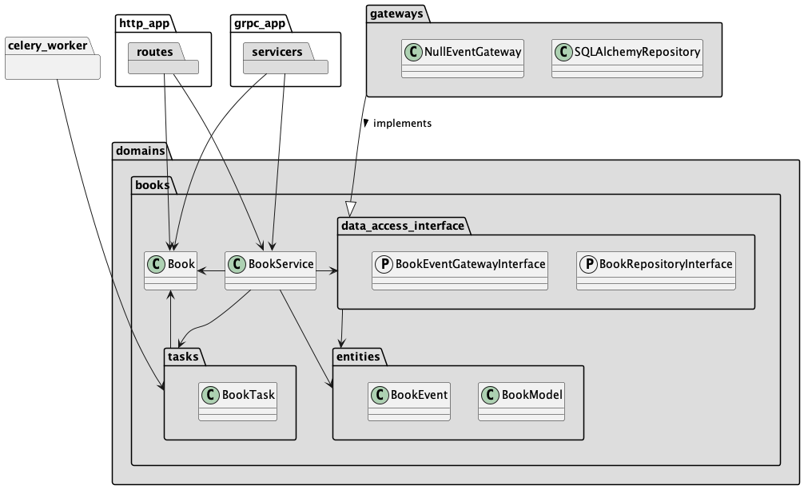
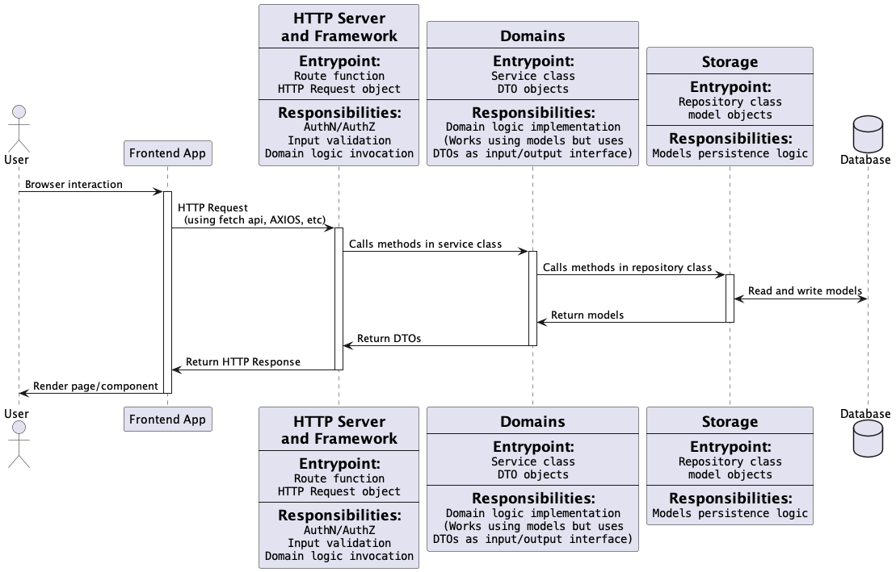

# Bootstrap python service

This is an example implementation of microservice applying
concepts from [Clean Architecture](https://blog.cleancoder.com/uncle-bob/2012/08/13/the-clean-architecture.html)
and [SOLID principles](https://en.wikipedia.org/wiki/SOLID).

* The repository classes are isolated behind interfaces, enforcing the [Interface Segregation principle](https://en.wikipedia.org/wiki/Interface_segregation_principle) 
  and the [Inversion of Control](https://en.wikipedia.org/wiki/Inversion_of_control) design pattern
* The application frameworks are decoupled from the domain logic
* The storage layer is decoupled from the domain logic

In this way our components are loosely coupled and the application logic
(the domains package) is completely independent of the chosen framework
and the persistence layer.

## HTTP API Docs and versioning

API documentation is provided by [FastAPI](https://fastapi.tiangolo.com/features/)
on `/docs` and `/redoc` paths using OpenAPI format.

I believe that versioning an API at resource level provides a much more
flexible approach than versioning the whole API.

The example `books` domain provides 2 endpoints to demonstrate this approach

* `/api/books/v1` (POST)
* `/api/books/v2` (POST)

## Package layers

This application is structured following the principles of Clean Architecture.
Higher level layers can import directly lower level layers. An inversion of control
pattern has to be used for lower level layers to use higher level ones.

Packages are ordered from the highest level to the lowest one.

------

* `http_app` (http presentation layer)
* `grpc_app` (grpc presentation layer)
* `storage` (database connection manager, repository implementation)

------

* `domains` (services, repository interfaces)

------

## Class dependency schema

## Data flow and layers responsibilities

## How to run

Using Docker:

* `make containers`: Build containers
* `docker compose run --rm dev make migrate`: Run database migrations
* `docker compose up dev`: Run HTTP application with hot reload
* `docker compose up grpc`: Run GRPC application
* `docker compose run --rm test`: Run test suite

Locally:

* `make migrate`: Run database migrations
* `make dev`: Run HTTP application with hot reload
* `make grpc`: Run GRPC application
* `make test`: Run test suite

## Other commands for development

* `make generate-proto`: Generates grpcio python stubs from `.proto` files in `grpc_app/proto` directory
* `make check`: Run tests, code style and lint checks
* `make fix`: Run tests, code style and lint checks with automatic fixes (where possible)

## Multistage dockerfile configuration

Python docker image tend to become large after installing the application requirements
(the slim base is ~150 MB uncompressed), therefore it's important to spend efforts
to minimise the image size, even if it produces a slightly more complex multistage
Dockerfile.

The following setup makes sure the production image will keep to a minimal size ("only" 390MB):
 * 150MB base image
 * 165MB python installed dependencies
 * 73MB poetry + updated pip

Using the following pipeline the "test" image is instead ~850MB, more than 400MB that would
end up as a cost in traffic on each image pull.

