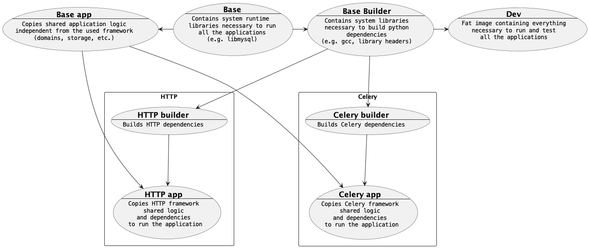

# Bootstrap python service

This is an example implementation of a python application applying
concepts from [Clean Architecture](https://blog.cleancoder.com/uncle-bob/2012/08/13/the-clean-architecture.html)
and [SOLID principles](https://en.wikipedia.org/wiki/SOLID).

* The repository classes are isolated behind interfaces, enforcing the [Interface Segregation principle](https://en.wikipedia.org/wiki/Interface_segregation_principle) 
  and the [Inversion of Control](https://en.wikipedia.org/wiki/Inversion_of_control) design pattern
* The application frameworks are decoupled from the domain logic
* The storage layer is decoupled from the domain logic

This template provides out of the box some commonly used functionalities:

* Sync and Async API Documentation using [FastAPI](https://fastapi.tiangolo.com/) and [AsyncAPI](https://www.asyncapi.com/en)
* Async tasks execution using [Dramatiq](https://dramatiq.io/index.html)
* Websocket application using [Socket.io](https://python-socketio.readthedocs.io/en/stable/index.html)
* Repository pattern for databases using [SQLAlchemy](https://www.sqlalchemy.org/) and [SQLAlchemy bind manager](https://febus982.github.io/sqlalchemy-bind-manager/stable/)
* Database migrations using [Alembic](https://alembic.sqlalchemy.org/en/latest/) (configured supporting both sync and async SQLAlchemy engines)
* Database fixtures support using customized [Alembic](https://alembic.sqlalchemy.org/en/latest/) configuration
* Authentication and Identity Provider using [ORY Zero Trust architecture](https://www.ory.sh/docs/kratos/guides/zero-trust-iap-proxy-identity-access-proxy)
* Full observability setup using [OpenTelemetry](https://opentelemetry.io/) (Metrics, Traces and Logs)
* Example CI/CD deployment pipeline for GitLab (The focus for this repository is still GitHub but, in case you want to use GitLab 🤷)
* [TODO] Producer and consumer to emit and consume events using [CloudEvents](https://cloudevents.io/) format using HTTP, to be used with [Knative Eventing](https://knative.dev/docs/eventing/)

## Documentation

The detailed documentation is available:

* Online on [GitHub pages](https://febus982.github.io/bootstrap-python-fastapi/)
* Offline by running `make docs` after installing dependencies with `make dev-dependencies`

## How to use

Create your GitHub repository using this template (The big green `Use this template` button).
Optionally tweak name and authors in the `pyproject.toml` file, however the metadata
are not used when building the application, nor are referenced anywhere in the code.

Before running any commands, install `uv` and `Docker`:

- You can install `uv` on Mac using `brew`: `brew install uv`
- Download and install Docker: https://www.docker.com/products/docker-desktop/

Using Docker:

* `make containers`: Build containers
* `docker compose up dev-http`: Run HTTP application with hot reload
* `docker compose up dev-socketio`: Run HTTP application with hot reload
* `docker compose up dramatiq-worker`: Run the dramatiq worker
* `docker compose run --rm test`: Run test suite
* `docker compose run --rm migrate`: Run database migrations
* `docker compose run --rm autogenerate-migration`: Generate a new migration file

Using Make (you still need Docker for most of them):

* `make install-dependencies`: Install requirements
* `make dev-dependencies`: Install dev requirements
* `make update-dependencies`: Updates requirements
* `make dev-http`: Run HTTP application with hot reload
* `make dev-socketio`: Run HTTP application with hot reload
* `make test`: Run test suite
* `make migrate`: Run database migrations
* `make autogenerate-migration`: Generate a new migration file

## Other commands for development

* `make check`: Run tests, code style and lint checks
* `make fix`: Run tests, code style and lint checks with automatic fixes (where possible)

## Multistage dockerfile configuration

Python docker image tend to become large after installing the application requirements
(the slim base is ~150 MB uncompressed), therefore it's important to spend efforts
to minimise the image size, even if it produces a slightly more complex multistage
Dockerfile.

The following setup makes sure the production image will keep to a minimal size ("only" 360MB):
 * 150MB base image
 * 210MB python installed dependencies

Using the following pipeline the "test" image is instead ~850MB, more than 400MB that would
end up as a cost in traffic on each image pull.

