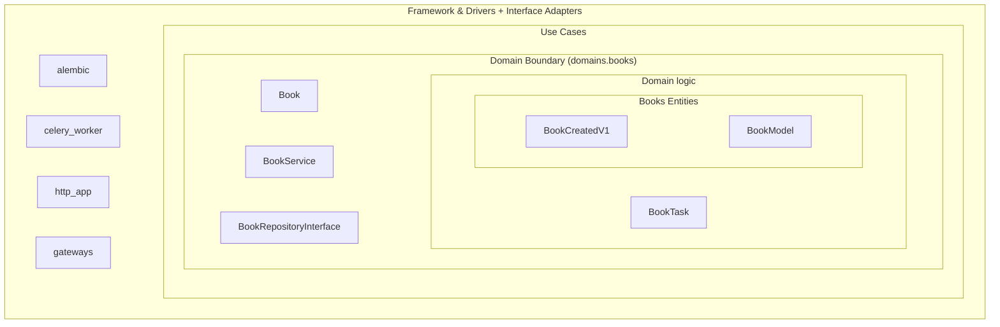
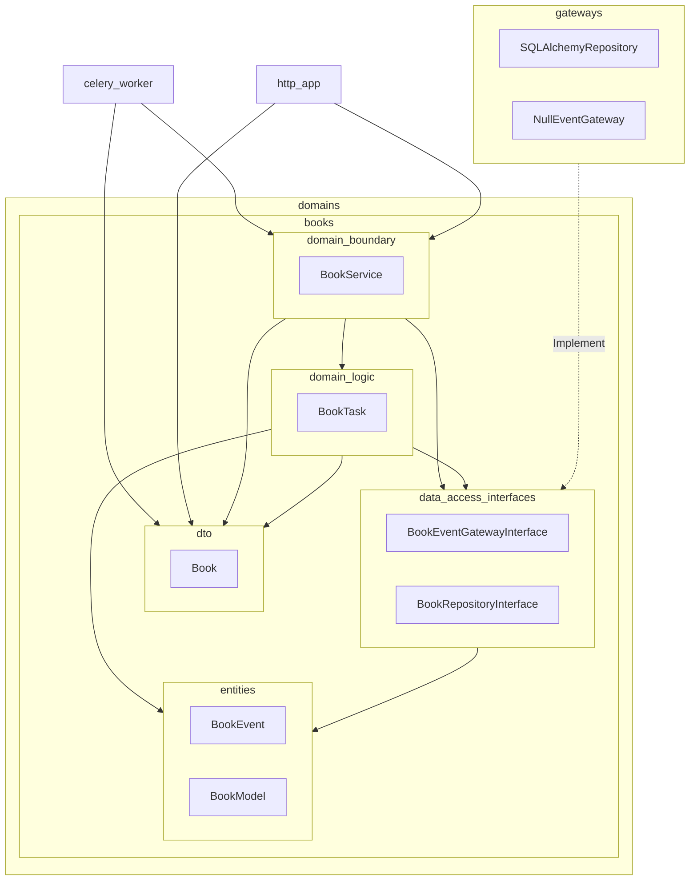

# Application architecture

This application is structured following the principles of Clean Architecture.
Higher level layers can import directly lower level layers. An inversion of control
pattern has to be used for lower level layers to use higher level ones.

In this way our components are loosely coupled and the application logic
(the domains package) is completely independent of the chosen framework
and the persistence layer.

This is a high level list of the packages in this application template:

* `alembic` (database migration manager)
* `celery_worker` (async tasks runner)
* `common` (some common boilerplate initialisation shared by all applications )
* `http_app` (http presentation layer)
* `gateways` (database connection manager, repository implementation, event emitter, etc.)
* `domains` (services, repository interfaces)

Each domain inside the `domains` packages has its own layers, depending on the complexity but
it is usually composed by at least 2 layers:

* Boundary layer (domain logic, DTO, data access interfaces): This layer is the only one that
  should be ever used directly by actors not belonging to the domain (i.e. HTTP routes, other domains)
* Domain Logic (this can be multiple layers, depending on the complexity)
* Entity layer (domain models): No one except the domain should ever use directly the domain models.

This is a high level representation of the nested layers in the application:

## Class dependency schema

A more detailed view showing the class dependencies and the absence of cyclical dependencies.

