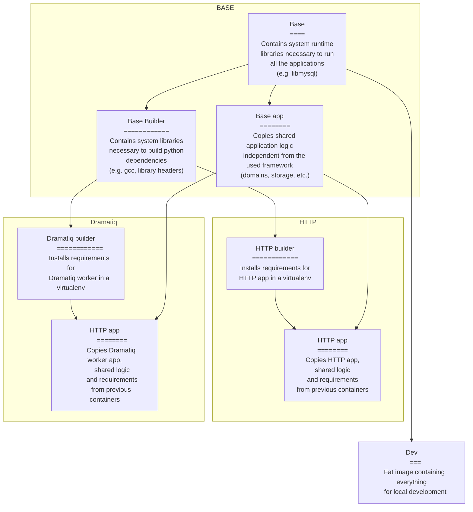

# Multistage Dockerfile

Python docker image tend to become large after installing the application requirements
(the slim base is ~150 MB uncompressed), therefore it's important to spend efforts
to minimise the image size, even if it produces a slightly more complex multistage
Dockerfile.

The implemented Dockerfile makes sure the production image will keep to a minimal size ("only" 360MB):
 * 150MB base image
 * 210MB python installed dependencies

If you look at the "dev" image is instead ~850MB, more than 400MB that would
end up as a cost in traffic on each image pull.

