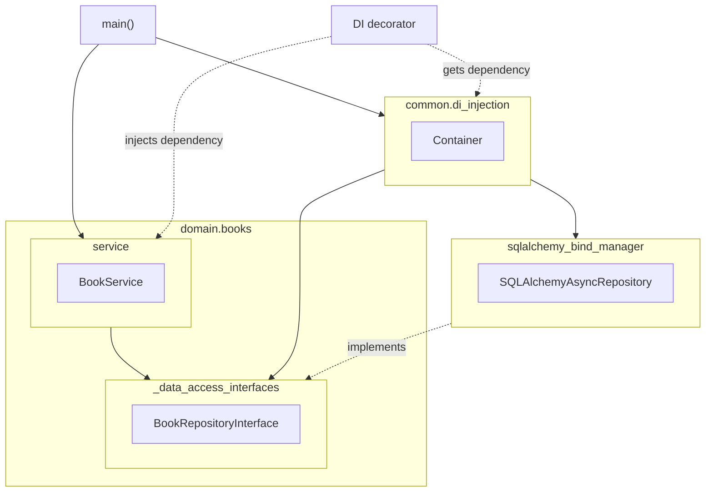
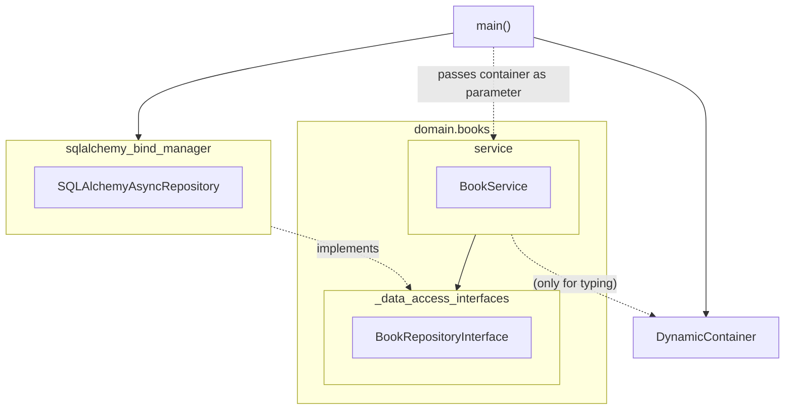
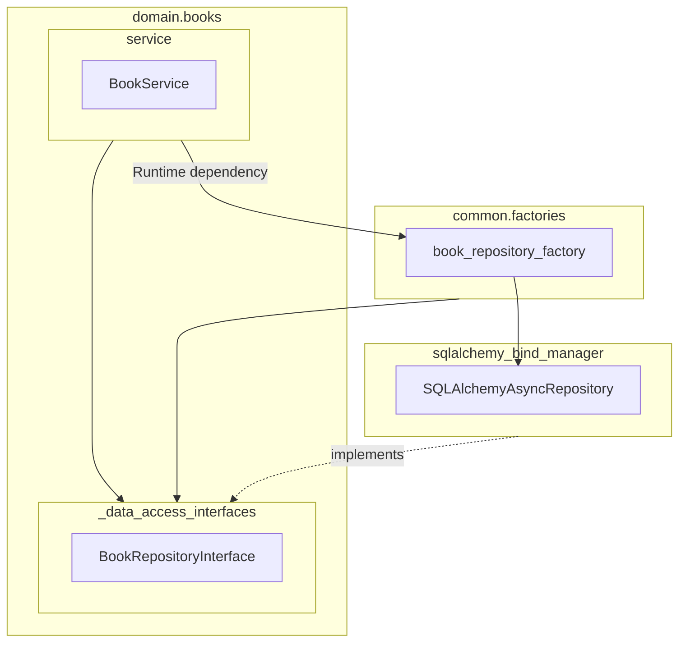

# Inversion of Control

Imagine the code:

```python
# This is file `dependency.py`
def do_something():
    print("I'm doing something")

# This is file `consumer.py`
from dependency import do_something
do_something()
```

The purpose behind using Inversion of Control is reversing the dependency flow in the
code we write. This means we want to `do_something()` without directly importing the
`dependency` module.

## Clean architecture and IoC

Following the principles from clean architecture, `domains` and its subpackages are not
allowed to directly use packages in higher layers and use inversion of control to use
their functionality. E.g.:

`domains.books` requires a repository class to access books in the database. Such
functionality is implemented in `SQLAlchemyAsyncRepository` class from
`sqlalchemy_bind_manager` external package.

`domains.books` contains a `BookRepositoryInterface` protocol that defines the expected
functionality and the whole domain logic is implemented depending on it.
There's no reference to the `SQLAlchemyAsyncRepository` concrete class or 
`sqlalchemy_bind_manager` package.

We use [dependency-injector](https://python-dependency-injector.ets-labs.org/) to inject
the concrete class whenever the protocol is expected:

```python
def main():
    Container()
    service = BookService()


# file `books/_gateway_interfaces.py`
class BookRepositoryInterface(Protocol):
    async def save(self, book: BookModel) -> BookModel:
        ...


# file `domains/books/_service.py`
from domains.books._gateway_interfaces import BookRepositoryInterface
from dependency_injector.wiring import Provide, inject


class BookService:
    book_repository: BookRepositoryInterface

    @inject
    def __init__(
            self,
            book_repository: BookRepositoryInterface = Provide["book_repository"],
    ) -> None:
        self.book_repository = book_repository


# file `bootstrap/di_container.py`
from sqlalchemy_bind_manager._repository import SQLAlchemyAsyncRepository
from dependency_injector.containers import DeclarativeContainer
from dependency_injector.providers import Factory


class Container(DeclarativeContainer):
    # Note that dependency-injector package only allows string references
    book_repository: Factory[BookRepositoryInterface] = Factory(
        SQLAlchemyAsyncRepository,
        # Other parameters needed by the class
    )
``` 

/// note | Dependency graph


///

## Alternate approaches to Dependency Injection

Using a Dependency Injection container is the easier solution because it usually takes
care of checking for circular dependencies and invalid setups, and it provides all sort
of helper functions and decorators. It is possible to achieve Inversion of Control
using different techniques (or by combining them together).

### Use directly the DI Container (Service Locator pattern)

Note that you'll want to pass the container in the class constructor and
not import it directly, otherwise you'll end up being dependent on the
concrete classes because nested imported modules, solving nothing.

/// note | Passing the required dependencies in separate parameters, rather than passing the container will make easier to override them in tests
    
///

```python
# file `domains/books/_service.py`
from dependency_injector.containers import DynamicContainer
from domains.books._gateway_interfaces import BookRepositoryInterface


class BookService:
    book_repository: BookRepositoryInterface

    def __init__(
            self,
            container: DynamicContainer,
    ) -> None:
        self.book_repository = container.book_repository()


# entrypoint
from domains.books._service import BookService
from dependency_injector.providers import Factory
from sqlalchemy_bind_manager._repository import SQLAlchemyAsyncRepository


def main():
    container = DynamicContainer()
    # Note that dependency-injector package only allows string references
    container.book_repository = Factory(
        SQLAlchemyAsyncRepository,
        # Other parameters needed by the class
    )
    service = BookService(container)
```
/// note | Dependency graph


///


### Use a factory

A factory helps with keeping in a single place the mapping between
`BookRepositoryInterface` and `SQLAlchemyAsyncRepository` but
**does not** actually implements the Inversion of Control pattern
(see the Dependency graph). We use local imports to:

* Hide the concrete dependencies when importing the factories module.
* Help with avoiding circular imports

/// admonition | Factories orchestration and circular dependencies
    type: warning

When you have multiple factories and their concrete classes depends
on each other, it could become difficult to orchestrate them so that
the life cycle of the concrete classes is handled in the correct order
and we don't end up in circular dependencies.
///

```python
# file `bootstrap/factories.py`
from domains.books._gateway_interfaces import BookRepositoryInterface


def book_repository_factory() -> BookRepositoryInterface:
    from sqlalchemy_bind_manager._repository import SQLAlchemyAsyncRepository
    return SQLAlchemyAsyncRepository()


# file `domains/books/_service.py`
from domains.books._gateway_interfaces import BookRepositoryInterface
from bootstrap.factories import book_repository_factory


class BookService:
    book_repository: BookRepositoryInterface

    def __init__(self) -> None:
        self.book_repository = book_repository_factory()
```

/// note | Dependency graph


///

### Other options

You could write a specific decorator to do dependency injection only for a single parameter.

/// admonition | Additional complexity
    type: warning

At this point the task is becoming more and more complex and we retain the runtime
dependency issue of the factory approach, plus introducing complexities like
identifying the parameter name.

We would need to implement the functionalities a dependency injection container already provides.
///

```python
# file `bootstrap/injectors.py` (Theoretical)
def inject_book_repository(f):
    @functools.wraps(f)
    def wrapper(*args, **kwds):
        # This allows overriding the decorator
        if "book_repository" not in kwds.keys():
            from bootstrap.storage import BookRepository
            kwds["book_repository"] = BookRepository()
        elif not isinstance(kwds["book_repository"], BookRepositoryInterface):
            import warnings
            warnings.warn(
                f"The specified object ({type(kwds['book_repository'])})"
                f" is not an instance of BookRepositoryInterface"
            )
        return f(*args, **kwds)

    return wrapper
```
