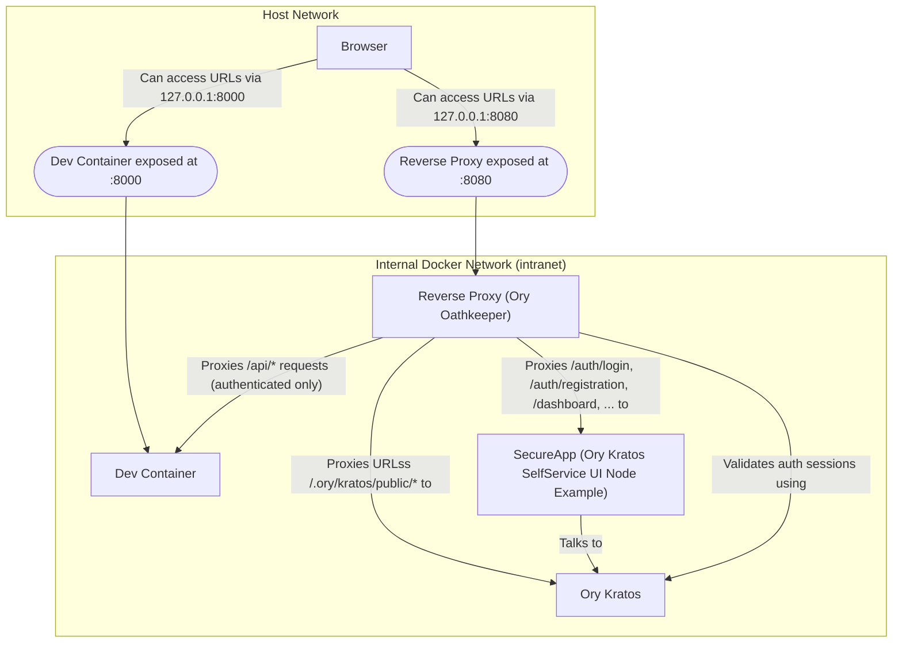

# Zero Trust architecture

This repository implements [ORY Zero Trust architecture](https://www.ory.sh/docs/kratos/guides/zero-trust-iap-proxy-identity-access-proxy)
using:

* [ORY Kratos Identity Server](https://github.com/ory/kratos) as authentication and identity provider.
* [ORY Oathkeeper](https://github.com/ory/oathkeeper) as reverse proxy to take care of authentication and access control.

If you access the API docs at `/docs` you will notice that the `/hello/` endpoint
is protected but the authentication infrastructure doesn't spin up when running
`docker compuse up dev`.

You can spin up all the authentication infrastructure by running `docker compose up oathkeeper`.
You should be able to access the authentication UI at [http://127.0.0.1:8080](http://127.0.0.1:8080) and,
after you will be authenticated, you will be able to access the protected `/hello`
endpoint at [http://127.0.0.1:8080/hello](http://127.0.0.1:8080/hello)

/// admonition | Cookie-based security
    type: warning

The current setup is built around the example authentication UI provided by ORY,
which uses the flows for browser-based application, with CSRF protection, and stores
the session token using Cookies.

While this is not a bad approach, it is not suitable for Single Page Applications
and API-based clients, because it is open to different vector attacks (CSRF among them).

Reference: [https://www.ory.sh/docs/kratos/self-service/flows/user-login#login-for-api-clients-and-clients-without-browsers](https://www.ory.sh/docs/kratos/self-service/flows/user-login#login-for-api-clients-and-clients-without-browsers)

🚧 An authentication flow using [Oauth2](https://oauth.net/2/), based on [ORY Hydra](https://github.com/ory/hydra)
and integrated with this setup, will be added in the future. It will provide provide secure flows for SPAs and other
API based clients. 🚧
///

This is a high level representation of the used components:

